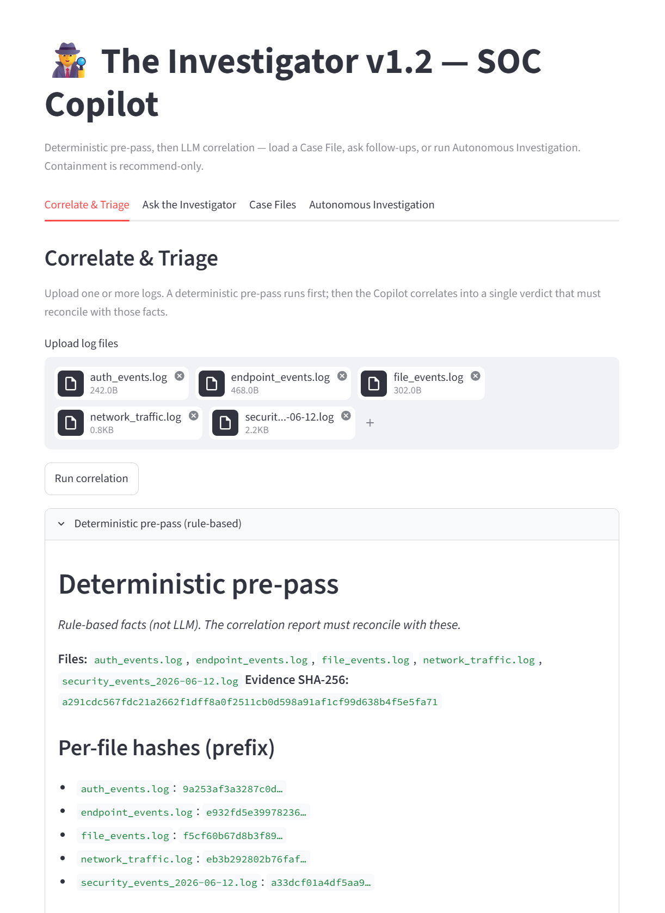
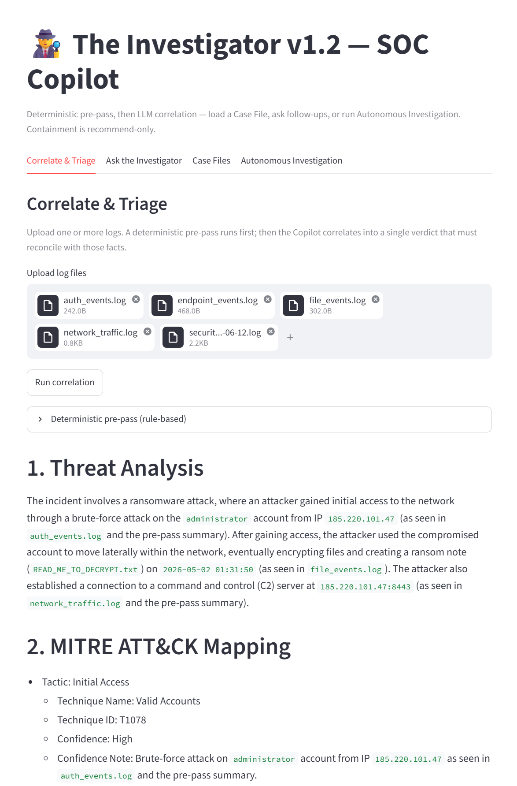

# The Investigator — AI Security & Network Copilot

An AI-powered security analyst that correlates logs into MITRE-mapped incident
reports and runs an autonomous investigation agent.

🔗 **Live app:** [https://the-investigator-aj3hchjtbanga5yjc3jodr.streamlit.app/](https://the-investigator-aj3hchjtbanga5yjc3jodr.streamlit.app/)  
📦 **Docker image:** `docker pull trshuler1/investigator-agent:1.0`

<table>
  <tr>
    <td align="center" width="50%">
      
      <br /><sub>Deterministic pre-pass</sub>
    </td>
    <td align="center" width="50%">
      
      <br /><sub>MITRE-mapped report</sub>
    </td>
  </tr>
</table>

## What it does
- **Correlate & Triage** — upload logs; a deterministic pre-pass runs first, then Groq returns a MITRE-mapped incident report (confidence, severity gates, Flags, case metadata)
- **Ask the Investigator** — case-aware chat grounded in the active report
- **Case Files** — browse saved reports under `reports/` and load one as the active case
- **Autonomous Investigation** — agent loop over `evidence/` (`list_evidence`, `read_log`, `lookup_mitre`, `run_prepass`) with an auditable trail — observe and recommend only
- **Pipeline triage** — when `evidence/` changes, GitHub Actions + Ollama write a report under `reports/`

## Tech stack
- Streamlit (Python), deployed on Streamlit Community Cloud
- Groq (Llama 3.3 70B) for the web app and CLI agent
- Ollama (local model) + GitHub Actions for the automated triage pipeline
- Docker for the containerized CLI agent
- MITRE ATT&CK for technique mapping
- Deterministic pre-pass (`prepass.py`) for failed logins, beaconing hints, and timeline/dwell before the LLM

## What v1.2 hardened
- Unverified LLM verdicts → pre-pass facts the model must reconcile; per-finding confidence; Critical only with multi-source support
- Action risk → containment labeled **RECOMMEND — verify before action**
- Weak provenance → evidence SHA-256 + pre-pass excerpt on saved reports; agent trail on autonomous verdicts

## Limits
Lab / portfolio aid — not a SOC system of record. No SSO/RBAC, no SIEM/EDR integrations, logs may go to a third-party API (Groq), and Cloud `reports/` can be shared or ephemeral. Use **Download** for a private copy. Humans own Critical calls and containment.

## Run locally

```bash
git clone https://github.com/Tshu282/the-investigator
cd the-investigator
pip install -r requirements.txt

# Add your key (never commit it):
#   .streamlit/secrets.toml  →  GROQ_API_KEY = "gsk_..."
# or: export GROQ_API_KEY=gsk_...

python -m streamlit run app.py
```

**CLI agent**
```bash
python agent.py
```

**Docker (CLI agent)**
```bash
docker pull trshuler1/investigator-agent:1.0
docker run --rm -e GROQ_API_KEY=gsk_... trshuler1/investigator-agent:1.0

# Or build from this repo:
# docker build -t investigator-agent .
# docker run --rm -e GROQ_API_KEY=gsk_... investigator-agent
```

**Pre-pass only / accuracy check (no API key)**
```bash
python prepass.py evidence
python verify_prepass.py
```

## Demo path
1. Correlate & Triage — upload `samples/` and/or `evidence/` → expand **Deterministic pre-pass** → read report + Case metadata  
2. Ask the Investigator — one case question (e.g. what to verify before isolate)  
3. Optional: Autonomous Investigation — audit the tool trail (watch for `run_prepass`)

## Skills built (course term)
- Weeks 1–2: analyst prompting; email triage (SPF/DKIM/DMARC, urgency/secrecy/authority)
- Weeks 3–4: `audit.py`, `hunt.py`, `timeline.py` (now feeding `prepass.py`)
- Week 5: `triage.py` + `ir_runbook.md` + Actions Auto-Triage
- Weeks 6–7: Streamlit SOC Copilot, Case Files, public deploy
- Week 8: agentic mode (CLI + Tab 4)
- Final: pre-pass in the critical path, confidence/Critical gates, case metadata, honest limits
